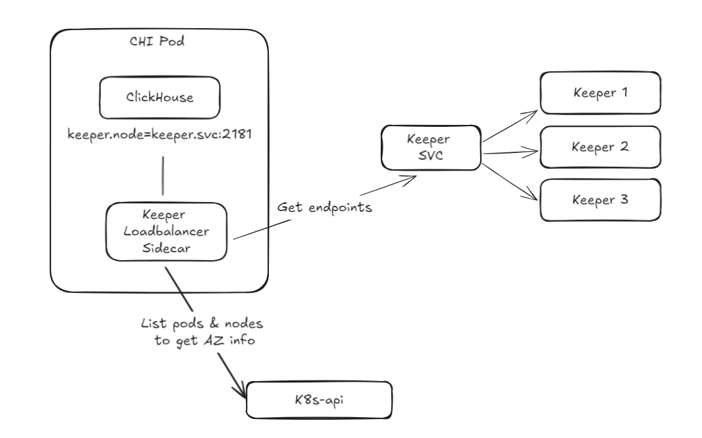

## Options

1. [Clickhouse >= 24.7 and ClickHouseKeeper](#clickhouse--247-and-clickhousekeeper)
1. [Clickhouse >= 24.7 and Zookeeper](#clickhouse--247-and-zookeeper)
1. [Fallback](#fallback)


### ClickHouse >= 24.7 and ClickHouseKeeper

[Setup](./k8s-chkeeper/README.md)

```
placement/use_imds: 1
zookeeper/prefer_local_availability_zone: 1
zookeeper/availability_zone_autodetect: 1
zookeeper/zookeeper_load_balancing: random
zookeeper/fallback_session_lifetime/min: 1800
zookeeper/fallback_session_lifetime/max: 7200
```

#### Requirements

1. ClickHouse 24.7+
1. ClickHouseKeeper
1. List of zookeepers in CH config (do not use service for LB)
1. Metadata service to detect AZ (AWS, GCP)


### ClickHouse >= 24.7 and Zookeeper

[Setup](./compose-23.8-altinity/README.md)

```xml
<zookeeper>
    <prefer_local_availability_zone>1</prefer_local_availability_zone>

    <zookeeper_load_balancing>random</zookeeper_load_balancing>
    <fallback_session_lifetime>
        <min>1800</min>
        <max>7200</max>
    </fallback_session_lifetime>
    <node>
        <host>clickhouse-keeper-01</host>
        <port>9181</port>
        <availability_zone>az1</availability_zone>
    </node>
    <node>
        <host>clickhouse-keeper-02</host>
        <port>9181</port>
        <availability_zone>az2</availability_zone>
    </node>
    <node>
        <host>clickhouse-keeper-03</host>
        <port>9181</port>
        <availability_zone>az3</availability_zone>
    </node>
</zookeeper>
```

#### Requirements

1. ClickHouse 24.7+
1. List of zookeepers in CH config (do not use service for LB)
1. Zone provided by operator


### Fallback




